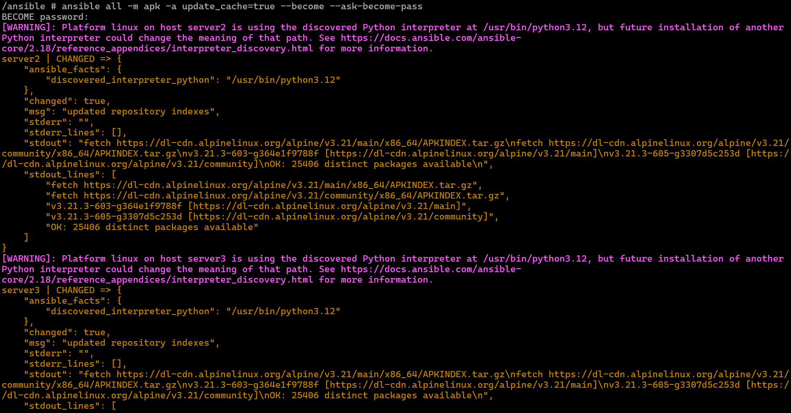
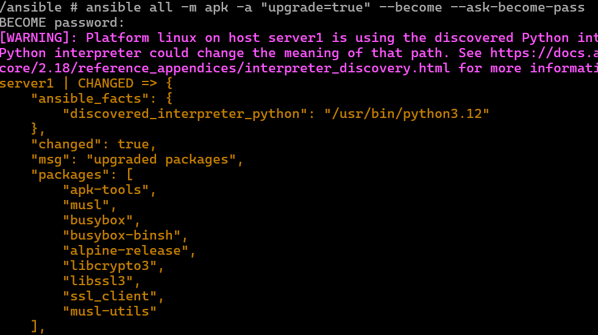

# Ad-Hoc Commands 

With the ansible.cfg file in place, the command to ping servers were shortened 

```
ansible all --key-file ~/.ssh/ansible -i inventory -m 
ansible all -i inventory -m ping
```
- The first command was shortened by editing the inventory file
- It was then shortened again by adding the ansible.cfg file to the following:

```
ansible all -m ping
```


- It is also possible to gather info on the servers/hosts including their environment variables  
- Ansible pulls info when it connects to a server which includes system hardware specs 

```
ansible all -m gather_facts
ansible all -m gather_facts --limit server1 		(for viewing against specific server) 
```
- Use case includes finding information for specific host, as well as for troubleshooting a specific processor or distro
- This also allows comparison for variables in **playbook** against how it is setup in server  

# Elevated Ad-Hoc Commands 

To have sudo permission the package needs to be installed first, this is done in the master container/node. 

```
apk add sudo 
```

- Once sudo is finished installing on each server, the file needs to be edited  
- The sudoers file (etc/sudoers) must be edited to include ansible as a user

```
(in the sudoers file) 
ansible ALL=(ALL) NOPASSWD: ALL		(bypasses need for password) 
``` 

- Then an update can be run on all three servers at the same time 

```
ansible all -m apk -a update_cache=true --become --ask-become-pass	(root password was set as "ansible" during setup) 
ansible all -m apk -a update_cache=true --become -i inventory		(if NOPASSWD is in place then run this to skip need to input a password) 
```
 

## Installing packages on servers 

Since servers can be updated all concurrently, packages can also be added in a similar way 

- only packages relative to the distro can be installed
- neovim and tmux can be installed for example 

```
ansible all -m apk -a name=neovim --become --ask-become-pass
ansible all -m apk -a name=tmux --become --ask-become-pass
```
- all packages can also be upgraded 

```
ansible all -m apk -a "upgrade=true" --become --ask-become-pass (upgrades all packages - Alpine)
ansible all -m apk -a "upgrade=true" --become --ask-become-pass (similar command but works on Debian/Ubuntu) 
```

 