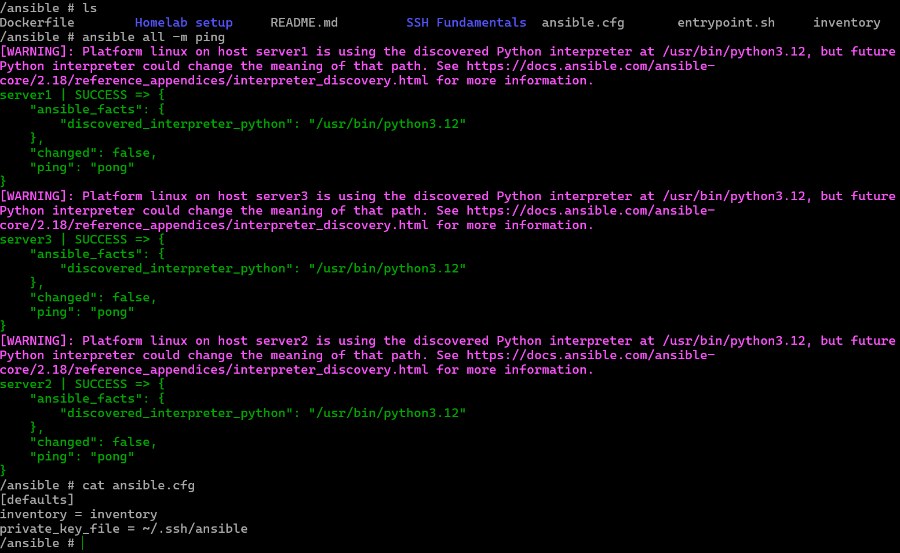

# Ad-Hoc Commands 

With the ansible.cfg file in place, the command to ping servers were shortened 

```
ansible all --key-file ~/.ssh/ansible -i inventory -m 
ansible all -i inventory -m ping
```
- The first command was shortened by editing the inventory file
- It was then shortened again by adding the ansible.cfg file to the following:

```
ansible all -m ping
```


- It is also possible to gather info on the servers/hosts including their environment variables  
- Ansible pulls info when it connects to a server which includes system hardware specs 

```
ansible all -m gather_facts
ansible all -m gather_facts --limit server1 		(for viewing against specific server) 
```
- Use case includes finding information for specific host, as well as for troubleshooting a specific processor or distro
- This also allows comparison for variables in **playbook** against how it is setup in server  