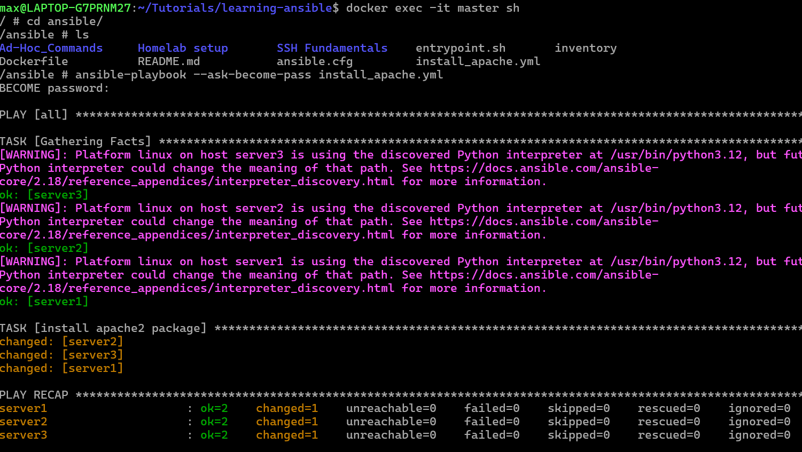

# Running playbooks 

- when a playbook is created, it can be run with an ansible command 
- this command installs apache on all the servers 

```
ansible-playbook --ask-become-pass install_apache.yml
```



- it is also possible to remove packages from all servers that have been installed

```
cp install_apache.yml remove_apache.yml
ansible-playbook --ask-become-pass remove_apache.yml	(state of package was changed to absent in file) 
```

## Importance of gathering facts

When running playbooks, often servers will have different distros installed such as CentOs, Alpine or Ubuntu

- Each distro has their own respective package manager such as apt, apk etc. 
- The **when** conditional in playbooks specifies which package should be installed based on the distro in use 
- To find the distro in use, the gathering_facts command can be used on the server 

```
ansible all -m gather_facts --limit server1
ansible all -m gather_facts --limit server1 | grep ansible_distribution
``` 
